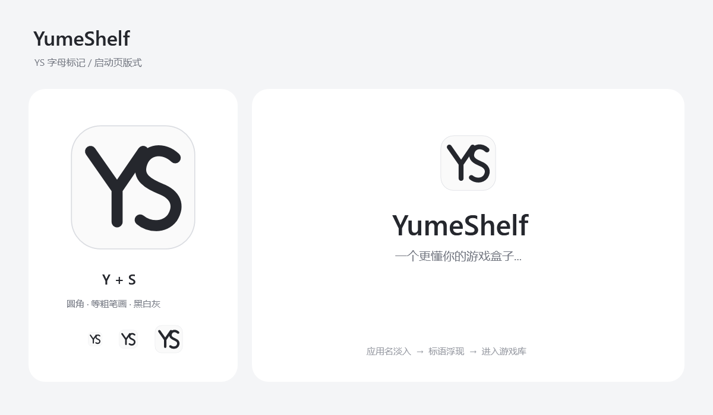

# YumeShelf 品牌图标与启动页

2026-09-20 确认：应用正式名称为 **YumeShelf**，内置智能体名为 **Yume**。品牌文案为“一个更懂你的游戏盒子...”。主窗口标题使用YumeShelf，侧栏副标题为“你的智能游戏盒子”，数据目录和程序集名称继续使用YumeShelf，既有用户数据无须迁移。

## 图标版式



采用Y与S的组合字母标记：Y的右上分叉与S的上弧衔接，以等粗、圆头笔画构建；浅白色圆角方形底，深灰字形和细灰轮廓。无需人物、游戏截图、纹理或多余装饰，小尺寸仍保留双字母结构。

- 矢量源：`src/YumeShelf/Assets/YumeShelfIcon.svg`，256×256逻辑画布，22单位笔画，圆角半径58；2026-09-22增大字形占比以改善小尺寸辨识。
- 字形：`#25272D`；底色：`#FAFAFA`；轮廓：`#DADCE1`；方形以外透明，便于日夜桌面显示。
- 应用PNG：512×512，用于侧栏与启动页；ICO包含16/20/24/32/40/48/64/128/256像素帧，用于可执行文件、标题栏与任务栏的原生图标资源。
- 图标源为路径，不依赖本机字体；启动页名称使用系统Segoe UI字体，中文沿用应用字体。

重新生成资源（在项目根目录）：

```powershell
powershell -NoProfile -STA -ExecutionPolicy Bypass -File scripts/render-brand.ps1
powershell -NoProfile -ExecutionPolicy Bypass -File scripts/update-icon.ps1
```

第一步从SVG生成应用PNG与本页版式图，第二步由PNG生成多尺寸ICO。SVG/PNG/ICO随源码提交；生成不使用外部图片服务，不新增运行时依赖。版式图是设计说明，运行时界面以下述实现为准。

### 小尺寸适配（2026-09-22）

用户反馈标题栏与侧栏的图标太小。原侧栏仅30×30，字形又有较多内部留白；窗口此前直接用512px PNG生成原生小图标，未使用ICO中的尺寸帧。

侧栏改为44×44逻辑像素，保持品牌文字居中并缩减下方间距；YS字形扩大且笔画由18加粗至22。16/20/24/32px ICO帧额外收紧边缘留白，窗口使用多帧ICO，侧栏和启动页继续使用高分辨率PNG。标题栏的图标槽位仍由Windows及DPI决定，本次优化槽位内的可辨识面积，不另造标题栏。

## 启动过渡

使用主窗口内的`StartupIntro`覆盖层，避免第二个窗口、额外任务栏图标及窗口跳动。窗口依照既有流程完成设置与本地库初始化后显示介绍；它是品牌过渡，不是后台加载进度页，也不伪造百分比。

| 阶段 | 时间 | 表现 |
| --- | --- | --- |
| 图标 | 0–320ms | 居中YS图标淡入 |
| 名称 | 140–620ms | YumeShelf淡入 |
| 标语 | 680–1160ms | 一个更懂你的游戏盒子...淡入 |
| 阅读停留 | 至2060ms | 保持简洁居中排版 |
| 进入主界面 | 2060–2300ms | 整个覆盖层淡出，显示游戏库 |

- 右下角“进入游戏库”按钮随时可用，Enter/Esc也可跳过；原生最小化、最大化和关闭按钮保留。
- 介绍期间禁用底层导航与游戏操作，结束后恢复键盘导航；名称和标语首帧透明，避免先完整出现再重播的闪烁。
- 每个主实例启动仅播放一次，切换库/设置/AI不会重播。第二个进程仍走原有单实例激活，不新建介绍窗口。
- 系统关闭客户端动画时立即进入游戏库，不强行等待；日夜背景与文字引用现有主题资源，保持字体对比。
- 关闭窗口时停止动画并撤除回调，跳过与自然结束幂等，避免重复完成。动画不联网、不调用模型、不保存配置、不修改游戏条目。

## 验证范围

正式回归`StartupChecks`覆盖名称先于标语、首帧、底层禁用、自动结束、跳过按钮/Enter/Esc、减少动画、关闭期间回调、切页不重播及隔离库数据保持，并输出日间小窗口与夜间渲染图。门禁继续检查设置/AI/扫描/存储/进程生命周期及发布原生图标。完整Windows发行环境与所有桌面图标缓存情形不以本次验证代替。
